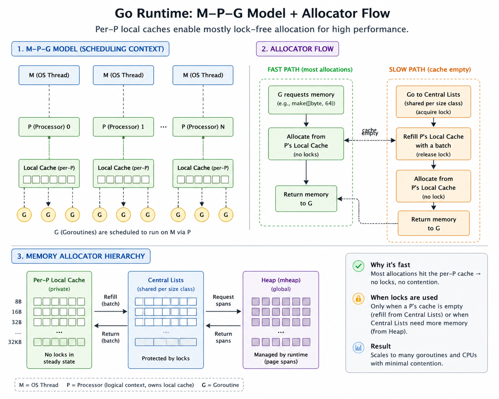

# Understanding the Go Runtime: The Bootstrap

**Date:** 2026-05-01  
**Category:** go

## What I Learned

Even a no-op Go program does a surprising amount of work before `main()` runs. The runtime sets up thread-local storage, initializes the scheduler, prepares memory allocation, starts garbage collection machinery, and creates the conditions that make goroutines cheap and efficient.

## Context

I do not have much professional Go experience on larger projects. While I have contributed on and off to a few, Claude does most of the heavy lifting, and the work usually ends up being problem-solving. Still, learning the internals of a programming language is always fun, so I started reading through this series.

This is a long but interesting read if you are new to Go. The blog starts with a simple comparison of execution time between two no-op programs written in C and Go.

The C program:

```c
int main() {
    return 0;
}
```

And the Go program:

```go
package main

func main() {
}
```

Here is the diagnostic:

```sh
$ gcc -o nothing_c nothing.c
$ go build -o nothing_go nothing.go

$ ls -lh nothing_c nothing_go
-rwxrwxr-x  1 user  user   16K Feb  7 12:05 nothing_c
-rwxrwxr-x  1 user  user  1.5M Feb  7 12:05 nothing_go

$ time ./nothing_c
real    0m0.001s

$ time ./nothing_go
real    0m0.002s
```

This clearly shows that something more is happening under the hood when a Go program runs. The extra time is effectively the setup Go does to provide benefits like background GC, large-scale concurrency through goroutines, and pre-allocated memory pools.

## Startup Steps

The following steps run when you execute a Go program. For more details, refer to [References](#references).

### Setting Up Thread-Local Storage

TLS is an OS-level mechanism that gives each thread its own private storage area. Different threads can read the same TLS slot and get different values.

Go uses TLS to store the pointer that answers questions like which goroutine is running in thread T1 or T2. This helps with scheduling without requiring locks. Go tests this by writing and reading a magic value at the start of the program, and immediately aborts if it fails. This hints at how it is better to fail at the start than midway through running the program.

### Checking the System Architecture

Each Go version has settings to identify the underlying architecture of the machine so that it can benefit from it efficiently.

### Scheduler Initialization

`schedinit()` (in [`src/runtime/proc.go`](https://github.com/golang/go/blob/go1.25.3/src/runtime/proc.go)) is the main initialization function that sets up all the critical runtime subsystems. There are multiple sub-steps to it:

- **Stop the World** ensures that no goroutines are currently running so that Go can do all the setup efficiently.
- **Stack Pool Initialization** initializes a pool of stack memory of size 2KB for the process, so spawning goroutines is ultra-fast. When a goroutine finishes, the stack memory goes back to this pool.
- **Memory Allocator Initialization** takes care of heap memory allocation. Each P keeps pools of heap memory from 8 bytes to 32KB and allocates them to goroutines accordingly. If there is a higher memory requirement, the allocator skips the pool and gets memory directly from the OS.

Here is a helpful diagram illustrating the Go scheduler model, which consists of Machines (M), Processors (P), and Goroutines (G):



- **CPU Flags and Hash Initialization** handles some initializations related to CPU capabilities and hardware support.
- **Modules, Types, and the Main Thread** sets up runtime tables for the type system and modules to work when loaded.
- **Args, Environment, and Security** checks the input args to the program and the env vars that are set.
- **Garbage Collector Initialization** sets up Go's concurrent mark-and-sweep GC, which does most of its work while your program keeps running instead of stopping everything.

The runtime sets up the machinery the GC will need later: the **pacer**, which decides when to trigger a collection (by default, when the heap has doubled in size); the **sweeper**, which reclaims unused memory after a collection; and the **per-P work queues**, which GC workers use to track which objects are still alive.

- **Processor (P) Initialization** sets up the processor to do work.

Each P comes with its own queue of goroutines waiting to run, its own memory cache so allocations are fast and do not need locks, and its own timers and GC worker state.

### `runtime.main`: The Last Mile

Before running your program, Go initializes the setup described above. Refer to `runtime.main()` in [`src/runtime/proc.go`](https://github.com/golang/go/blob/go1.25.3/src/runtime/proc.go).

- **Max Stack Size and System Monitor** sets the max stack size to 1GB per goroutine on a 64-bit system. If it exceeds that due to an infinite loop, memory leak, or similar issue, the system will panic and halt.

The system monitor (`sysmon`) is a dedicated background thread that acts as the runtime's watchdog. It runs independently from the scheduler, keeping an eye on things: if a goroutine has been hogging a P for too long, `sysmon` forces it to yield. If an OS thread has been stuck in a system call, `sysmon` takes its P away and gives it to another thread so other goroutines can keep running. It also nudges the GC if it has not run in a while, checks for network I/O that is ready, and returns unused memory to the OS.

- **Runtime `init()` Functions** starts the runtime's own init function. Not much detail here.
- **Enabling the Garbage Collector** spawns the background sweeper and scavenger goroutines.
- **Running Package `init()` Functions** runs the imports and init functions at the start of the main function.

### The Main Program Runs

All the speed and smooth coordination can be attributed to the startup magic that happens when a Go program runs.

## References

- [Understanding the Go Runtime: The Bootstrap](https://internals-for-interns.com/posts/understanding-go-runtime/)
