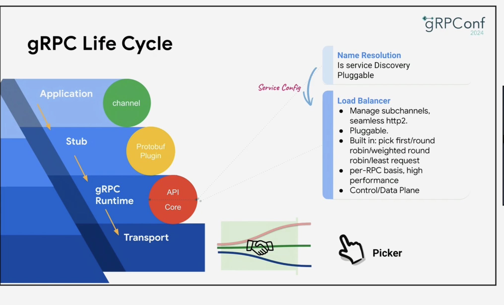
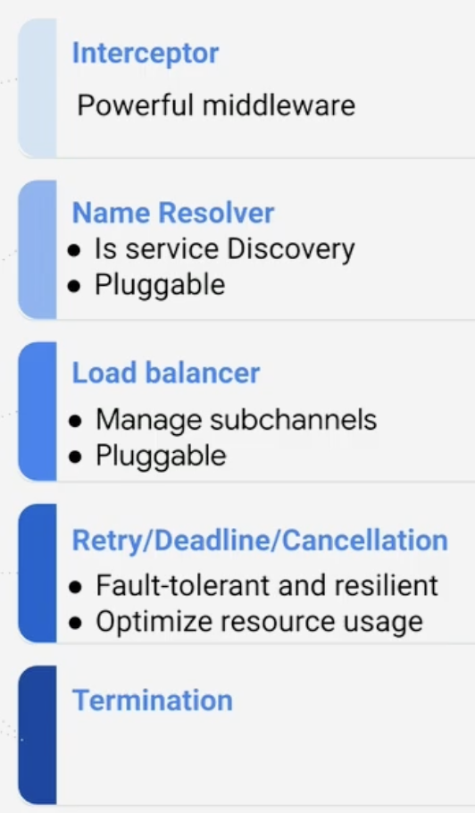

# gRPC - Intro

**Date:** 2026-01-01  
**Category:** grpc,easy

## What I Learned

gRPC is another form API exposure like REST, GraphQL etc. gRPC offers a slightly different way of execution
i.e. RPC or Remote procedure calls (Oh, we have heard of it in OS / Networking classes). On a high level,
everything happens like a function/procedure call which the client triggers with inputs, server executes and returns the response. 
More formally, we call a stub; which is a local object that acts as a client-side placeholder or proxy for a remote service.
 
You can expose your gRPC services in any language of your choice like Go, .NET, Python, C++ etc. Underneath, gRPC
uses `protobuf` as the format of data transmission [serialization/deserialization format] (more efficient than json). gRPC uses HTTP/2 (on top of TCP connection) as the L7-layer.

## Details
gRPC is blazing fast and becomes very efficient for inter-service communication. But why is gRPC so fast ?? 
1. Uses `protobuf`. It does binary encoding, has efficient parsing, and reduces message size -> requires less network bandwidth to transfer over the wire.
2. Uses `HTTP/2`. It does header compression, compatible with proxies and load balancers, reduce TCP connections.

### gRPC channel
It represents a long-lived, virtual connection from the client to a gRPC service on a specific host and port. Channel is an abstraction over the networking details such as name resolution, connection establishment (including retries and backoff), and TLS handshakes. 
Using the same channel we send multiple gRPC calls spawning multiple threads etc.  
gRPC allows multiple RPC calls to be multiplexed over a single HTTP/2 connection (channel), making it more efficient than HTTP/1.x, where each request often requires a separate connection or is serialized over one.

### gRPC life cycle
 
**Load balancer does a lot of magic to make gRPC performant**. Under the hood, it does facilitate multiplexing and maintenance of sub channels effectively with health checks etc. For eg. if any service which had connection goes down; it repairs the sub channel link to a healthy server.

4 types of request-response cycle is supported:
1. single request / response
2. client streaming only
3. server streaming only
4. bi-directional streaming

### Interceptors
Similar to middleware, that act on the request / response. Interceptors can be on both client and server side.
If we have an SDK, that makes gRPC calls we can write client side interceptors to:
1. Add JWT / OAuth token to gRPC metadata
2. Add correlation-IDs to each requests etc.

Client sends msg -> Client interceptor -> Wire -> Server: receive msg -> Server interceptor

### Deadline / Cancellation
Similar to timeout in REST APIs. In case of multiple services involved in a requests; DEADLINE_EXCEEDED failures
are effectively propagated in gRPC. Always set deadlines [Best practice]

Just like deadline, cancellation is propagated as well. It is on the application code's responsibility if they want to stop processing when a CANCEL signal is received.

### Retries
Retries are inbuilt in gRPC. Clients can configure the retry policy.

## References

- [gRPC - Basics tutorial](https://grpc.io/docs/languages/python/basics/)
- [Introduction to gRPC](https://grpc.io/docs/what-is-grpc/introduction/)
- [gRPC - Core concepts](https://grpc.io/docs/what-is-grpc/core-concepts/)

