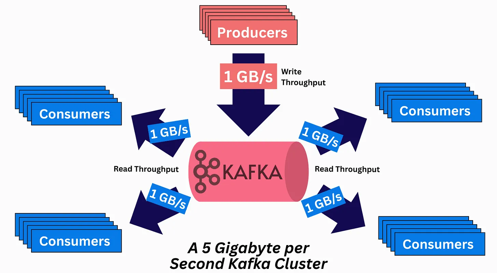
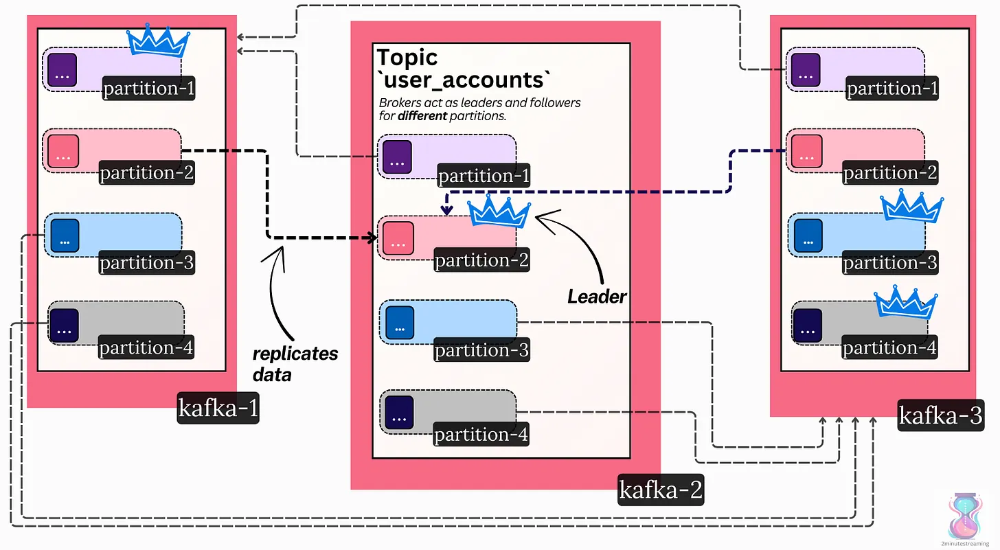

# How Kafka Works

**Date:** 2026-05-09  
**Category:** Kafka

## What I Learned

Kafka is a distributed, durable pub/sub system built around append-only logs. These notes cover why Kafka is useful for data integration, how topics, partitions, brokers, replication, and consumer groups work, and how features like Kafka Streams, Schema Registry, and Kafka Connect fit into the ecosystem.

## Context

I read through a long article on Kafka and used a few supporting resources to understand the basics, especially how Kafka applies to real-world system design problems.

## Details

These notes come from my reading of this [newsletter](#references), which starts with the author's description of Kafka:

> “It’s an open-source, distributed, durable, very scalable, fault-tolerant pub/sub message system with rich integration and stream processing capabilities.”

The author starts by describing Kafka's original use case: data integration between services when read throughput is much higher than write throughput.

For example, suppose there is a Facebook-like app with a service `S1` that receives a request saying Account `A1` accepted a friend request from Account `A2`. This information now needs to be passed to multiple other services, such as the `Friend List Service` (`S2`), which maintains account friend lists, and the `News Feed Service` (`S3`), which sends the event of `A1` and `A2` becoming friends to mutual accounts in their news feed.

In this scenario, `S1` needs to pass information to `S2` and `S3`. Rather than creating ad hoc connections between these services, `S1` can pass the message into a queue. Listeners or recipients can then subscribe to that event and take the necessary actions. This is exactly what a pub/sub system supports.

To understand Kafka's use cases, I also referred to [Why Was Apache Kafka Created?](https://bigdata.2minutestreaming.com/p/why-was-apache-kafka-created).

### Basic Kafka Concepts

Kafka uses a [log data structure](https://topicpartition.io/definitions/the-log) as the underlying structure for storing data. It is append-only, which takes advantage of sequential reads and writes. This is efficient for HDDs because there are no disk seeks. It also makes Kafka durable because data can be written to disk directly and efficiently.

Writes are ordered, immutable, and O(1), while reads remain efficient even under high concurrency.

Kafka stores records as bytes. The SDKs handle the schema and the conversion to and from bytes.

Topics and partitions are two important concepts in Kafka.

Topics are logical separations of data. Partitions are the actual separation, meaning a single partition refers to one log file. A topic can have multiple partitions.

Choosing the key that identifies which partition a message belongs to is crucial, since poor key design can lead to challenges such as hot partitions.

Kafka follows a pull-based pattern. Consumer APIs allow consumers to pull from a partition, topic, and so on.

Brokers in Kafka are like physical nodes in a cluster. A broker is a physical unit that can hold multiple partitions. Kafka is horizontally scalable because we can add more brokers to the cluster to handle different types of messages. Messages inside one partition are independent of messages in other partitions, so only messages inside the same partition maintain ordering guarantees.

Kafka has built-in, configurable replication to provide durability guarantees. To maintain data sync guarantees, Kafka follows a simple leader method: only the leader serves reads and writes, and it acts as the primary source of truth. Followers, or replicas, continuously stay in sync and are ready to take over if the leader goes down.

In the image, we can see a replication factor of 3, and each broker distributes leadership of different partitions to provide fault-tolerant guarantees.

### The Distributed Consensus Problem

Kafka uses a centralized coordination model. Basically, a log file resides with the controller nodes. Kafka stores all metadata information inside a partition named `__cluster_metadata`. The controller broker writes to it, while the regular brokers listen to this partition and adjust among themselves.

The controller node, or controller broker, is similar to regular Kafka brokers, but it does the work of controlling and coordinating the entire cluster. A set of controller brokers forms what we can call the control plane.

The next question is: who decides the leader broker inside the control plane?

Kafka uses its own modified version of Raft named [KRaft](https://newsletter.systemdesign.one/i/174189967/kraft).

To keep it short, the way leader election in Kafka works is:

- Leader election between the controllers, which picks the active one, is done through a variant of Raft called KRaft.
- Leader election between regular brokers is done through the controller.

Kafka has excellent data-retention capabilities out of the box because it writes data to disk. This serves use cases that require **replayability**.

Kafka can be configured to use S3, GCS, and so on as secondary storage, which makes it cost-efficient. Here is how the storage scheme works:

1. Messages are written to Kafka by the producer.
2. With 1 GB/s of bandwidth, the brokers' HDDs/SSDs would fill up quickly if everything stayed on the broker itself. To avoid this, Kafka periodically flushes old data to S3.
3. Later, if a consumer asks for a very old event, Kafka abstracts the logic, fetches the data from S3 correctly, and serves it to the consumer.

This technique has another benefit: if a replica or broker goes down, it does not need to populate TBs of data during startup. It can keep a small chunk of recent events on its disk, and the rest can be fetched from S3 directly.

### Consumer Groups and Read Parallelization

- Currently, only one consumer from a given consumer group can read from a Kafka partition. This helps ensure message-order guarantees, and no locks are required.
- One consumer cannot process a high volume of data across multiple partitions, which is why consumer groups exist. A consumer group is basically a set of consumers, and it can be dynamically scaled by adding more consumers.
- Based on the use case, we can either add more consumers inside a group or add more consumer groups. Consumer group distinctions are primarily based on the functionality or service the consumer serves.

So, what happens when a consumer inside a consumer group goes down? We need to start a new consumer in the group that reads the partition from where the previous consumer left off. To solve this, Kafka has the concept of a *group coordinator* inside a consumer group, which stores a simple mapping of *{partition, offset}* in a special Kafka topic called `__consumer_offsets`. This helps save progress on what record the consumer has read up to.

Kafka additionally supports exactly-once processing, which is a bit complex and left as a TODO [here](https://newsletter.systemdesign.one/i/174189967/transactions-and-exactly-once-processing) and [here](https://blog.2minutestreaming.com/p/kafka-consumer-group-basics).

### Other Kafka Features

Other features on top of Kafka include:

#### Kafka Streams

Kafka Streams is an out-of-the-box feature that provides streaming capabilities. Under the hood, it makes use of Kafka's architecture with some smart handling and additional processing.

#### Schema Registry

While Kafka does not do automatic serialization or deserialization, various registries are present for efficient schema conversion. The end-to-end path conventionally works like this:

1. Producers decide on a schema, associate it with a topic, and register it in the registry.
2. Producers then serialize the message in the correct structure, including the unique schema ID in the message, and write it to Kafka.
3. Consumers download the message, parse the schema ID, then fetch and cache the schema from the registry.
4. Consumers use the schema to deserialize the message.

#### Kafka Connect

Kafka Connect is basically a configuration-based framework that helps set up connectors between Kafka and different sink/source connectors, such as Postgres, MySQL, Snowflake, Redis, and so on. One need not write their own Kafka client or deal with application logic to read from and write to Kafka. See the list of various connectors [here](https://www.confluent.io/hub/).

This was one of the longest articles I have read. While reading it for the first time, it felt overwhelming, so I referred to multiple resources and introductory blogs to get started. This [Hello Interview article](https://www.hellointerview.com/learn/system-design/deep-dives/kafka) is particularly nice for understanding the application of Kafka in various real-world problems.

## References

- [How Kafka Works - Neo Kim](https://newsletter.systemdesign.one/p/how-kafka-works)

